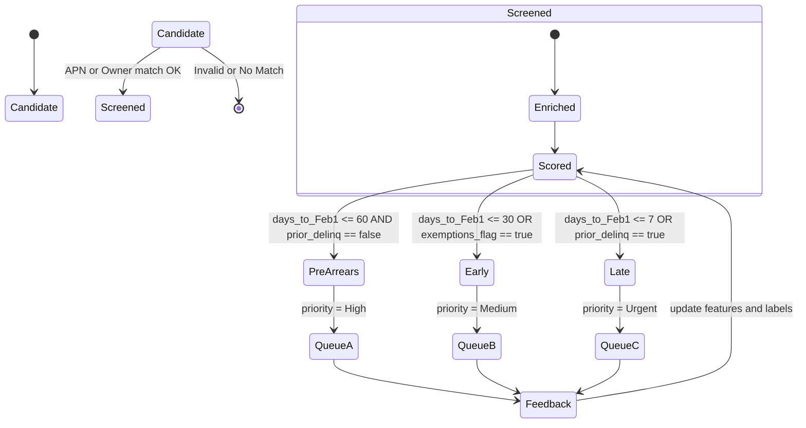
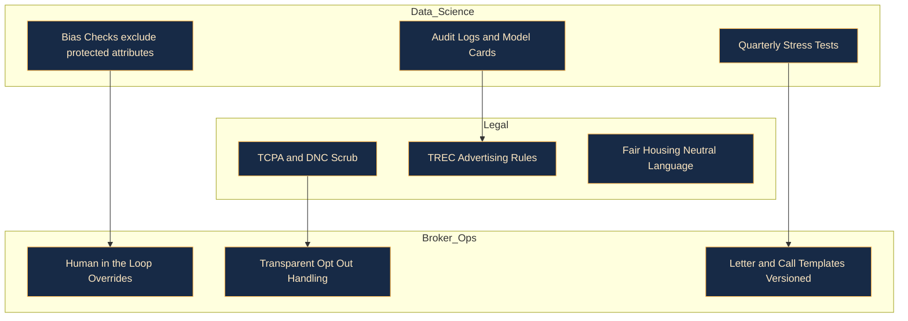

# 🏠 Real Estate Pre-Arrears AI Solution

[](https://github.com/)

---

## 📌 Project Overview
This project provides an **end-to-end AI solution** for real estate brokerages in Texas to **identify and engage homeowners at risk of property tax arrears** *before* county delinquent lists are published.

The system blends:
- County data ingestion
- Risk scoring
- Broker-friendly dashboards
- Compliant outreach (letters, calls, CRM sync)
- Continuous feedback loops

---

## ⚡ TL;DR — Texas Property Tax Arrears
- **Bills issued:** October  
- **Delinquent:** February 1  
- **Penalties:** 6% first month + 1% monthly until July; 12% penalty in July + monthly interest  
- **Final step:** County tax sales, often heavily competitive

> ✅ Early outreach positions brokers **ahead of investor-heavy public sale lists**.

---

## 🔎 Probing Questions (Kickoff Checklist)
1. Which **counties** first? (Dallas, Tarrant, Harris?)  
2. How do you access **county data** (CSV, PDF, HTML)?  
3. **Update cadence** (daily during tax season, weekly otherwise)?  
4. **Property scope:** homestead only, or include commercial?  
5. **Exclusions:** probate, age/disability exemptions?  
6. **Outreach rules:** postal, calls (TCPA/DNC scrubbing), bilingual letters?  
7. **Compliance guardrails:** TREC advertising, fair housing, disclosures?  
8. What **CRM** should integrate (kvCORE, HubSpot, etc.)?

---

## 🔄 End-to-End Workflow (compat mode)

```mermaid
graph LR
  A[County Sources: CAD, Tax Roll, Sale Lists] --> B[Ingestion and Parsing: CSV, PDF, HTML]
  B --> C[Normalization and Matching: Address, Owner, APN]
  C --> D[Feature Engineering: days to Feb 1, prior delinquency, exemptions, value trend]
  D --> E[Risk Scoring: Pre Arrears, Early, Late]
  E --> F[Broker App: Queues, Maps, Profiles]
  F --> G[Compliant Outreach: Mail, Call, permitted Email]
  G --> H[CRM Sync and Outcomes: Attempt, Connect, Appointment, Listing]
  H --> I[Feedback Loop: Win Loss, Message effectiveness]
  I --> D

  %% light styling that GitHub supports
  style A fill:#0b2239,stroke:#5fa8ff,stroke-width:2px,color:#eaf2ff
  style B fill:#102a49,stroke:#5fa8ff,stroke-width:2px,color:#eaf2ff
  style C fill:#102a49,stroke:#5fa8ff,stroke-width:2px,color:#eaf2ff
  style D fill:#123a63,stroke:#7ec8ff,stroke-width:2px,color:#eaf2ff
  style E fill:#123a63,stroke:#7ec8ff,stroke-width:2px,color:#eaf2ff
  style F fill:#0b2e4a,stroke:#7ec8ff,stroke-width:2px,color:#eaf2ff
  style G fill:#1f2a3a,stroke:#ffb84f,stroke-width:2px,color:#ffe8c2
  style H fill:#0a1f33,stroke:#8ad3ff,stroke-width:2px,color:#eaf2ff
  style I fill:#123a63,stroke:#7ec8ff,stroke-width:2px,color:#eaf2ff
````

---

## 👩‍💻 Broker User Journey

```mermaid
journey
  title Broker Pre-Arrears Workflow
  section Setup
    Select Counties (Dallas, Tarrant): 4:Broker
    Connect Data Sources (CSV/PDF/HTML): 3:System
  section Scoring and Queue
    Normalize and Score Owners: 5:System
    Prioritized Queue by Risk: 4:Broker
  section Outreach
    Review Owner Card and Talk Track: 5:Broker
    Generate Letter or Schedule Call (TCPA/DNC): 4:Broker
  section Results
    Track Outcomes in CRM: 4:Broker
    Next Best Action Recommendation: 5:System
```

---

## 🧠 Risk Scoring Logic



---

## 🪜 Step-by-Step Action Plan

*Phase 1 — Discovery & Compliance (Week 1–2)*

* Select 2 pilot counties (Dallas + Tarrant).
* Confirm legal guardrails with broker and counsel.
* Define metrics: 10 appointments/month → 3 signed listings/month.

*Phase 2 — Data & Scoring (Week 3–5)*

* Connect county data (CSV/PDF/HTML).
* Normalize APNs and owner data.
* Score by: near delinquency, exemptions, history, value trends.

*Phase 3 — App & Outreach (Week 6–8)*

* MVP dashboard: map + list + owner card + letter generator.
* CRM sync + DNC scrub.
* Train agents on talk-track + letter.

*Phase 4 — Pilot & Iterate (Week 9–10)*

* Two 2-week sprints.
* Measure connect rate, appointment rate, listing rate.

*Phase 5 — Scale (Week 11–12)*

* Add Harris + smaller counties.
* Weekly refresh outside tax season.
* Weekly “insight emails” → top properties, zips, wins.

---

## 📅 Delivery Timeline

```mermaid
gantt
  dateFormat  WW
  title 12-Week Delivery Plan
  section Phase 1 — Discovery and Compliance
  Select pilots Dallas and Tarrant      :done, p1a, 01, 02
  Guardrails and metrics                 :active, p1b, 02, 02
  section Phase 2 — Data and Scoring
  Connect data and normalize             :p2a, 03, 03
  Feature engineering and scoring        :p2b, 04, 02
  section Phase 3 — App and Outreach
  MVP dashboard and owner card           :p3a, 06, 02
  CRM sync and DNC scrub                 :p3b, 07, 01
  Agent training talk track and letter   :p3c, 08, 01
  section Phase 4 — Pilot and Iterate
  Sprint 1 and metrics                   :p4a, 09, 01
  Sprint 2 and adjust thresholds         :p4b, 10, 01
  section Phase 5 — Scale
  Add Harris and minors                  :p5a, 11, 01
  Weekly refresh and insights            :p5b, 12, 01
```



---

## 📊 SWOT Analysis

**Strengths**

* Early visibility before public lists
* Standard Texas deadlines simplify playbooks

**Weaknesses**

* Data fragmentation across counties
* Outreach tone risk (owners may fear “predatory” tactics)

**Opportunities**

* Build goodwill with education
* Consistent early pipeline ahead of investors

**Threats**

* Policy/calendar changes
* Compliance missteps (TCPA/TREC)

---

## 🛡️ Guardrail Best Practices (compat mode)



---

## 📅 Checklists

**Daily (Jan–Mar)**

* Refresh lists
* Assign 10 outreach tasks/agent
* Log outcomes

**Weekly (Rest of Year)**

* Refresh lists
* Send insight email
* Review KPIs

---

## 📎 License & Credits

* Built with Texas Comptroller and County data (Tarrant, Dallas, Harris).
* References: Texas Tax Code Ch. 33 (penalties and interest).
* License: MIT.

```

If anything *still* fails to render, it’s almost always due to the Mermaid version in that renderer. In that case, keep these “compat” blocks and we can tuck fancier versions into `/docs/diagrams/` for GitHub Pages (which tends to be more up to date).
::contentReference[oaicite:0]{index=0}
```

