# 🏠 Real Estate Pre-Arrears AI Solution

[](https://github.com/)

---

## 📌 Project Overview
This project provides an **end-to-end AI solution** for real estate brokerages in Texas to **identify and engage homeowners at risk of property tax arrears** *before* county delinquent lists are published.  

The system blends:
- County data ingestion
- Risk scoring
- Broker-friendly dashboards
- Compliant outreach (letters, calls, CRM sync)
- Continuous feedback loops

---

## ⚡ TL;DR — Texas Property Tax Arrears
- **Bills issued:** October  
- **Delinquent:** February 1  
- **Penalties:** 6% first month + 1% monthly until July; 12% penalty in July + monthly interest  
- **Final step:** County tax sales, often heavily competitive  

> ✅ Early outreach positions brokers **ahead of investor-heavy public sale lists**.

---

## 🔎 Probing Questions (Kickoff Checklist)
1. Which **counties** first? (Dallas, Tarrant, Harris?)  
2. How do you access **county data** (CSV, PDF, HTML)?  
3. **Update cadence** (daily during tax season, weekly otherwise)?  
4. **Property scope:** homestead only, or include commercial?  
5. **Exclusions:** probate, age/disability exemptions?  
6. **Outreach rules:** postal, calls (TCPA/DNC scrubbing), bilingual letters?  
7. **Compliance guardrails:** TREC advertising, fair housing, disclosures?  
8. What **CRM** should integrate (kvCORE, HubSpot, etc.)?  

---

## 🔄 End-to-End Workflow

```mermaid
%%{init: {"theme":"dark","themeVariables":{
"primaryColor":"#0f2035","primaryTextColor":"#eaf2ff","primaryBorderColor":"#5fa8ff",
"lineColor":"#9fb5ff","tertiaryColor":"#0b1726"}}}%%
flowchart LR
  classDef src   fill:#0b2239,stroke:#5fa8ff,stroke-width:2px,color:#eaf2ff;
  classDef proc  fill:#102a49,stroke:#5fa8ff,stroke-width:2px,color:#eaf2ff;
  classDef ml    fill:#123a63,stroke:#7ec8ff,stroke-width:2px,color:#eaf2ff;
  classDef ui    fill:#0b2e4a,stroke:#7ec8ff,stroke-width:2px,color:#eaf2ff;
  classDef comp  fill:#1f2a3a,stroke:#ffb84f,stroke-width:2px,color:#ffe8c2;
  classDef store fill:#0a1f33,stroke:#8ad3ff,stroke-width:2px,color:#eaf2ff;
  linkStyle default stroke:#9fb5ff,stroke-width:1.6px;

  subgraph DATALAYER["Data Layer"]
    A[County Sources<br/>(CAD, Tax Roll, Sale Lists)]:::src
    B[Ingestion & Parsing<br/>(CSV | PDF | HTML)]:::proc
    C[Normalization & Matching<br/>(Address, Owner, APN)]:::proc
  end

  subgraph INTELLIGENCE["Scoring & Intelligence"]
    D[Feature Engineering<br/>(days_to_Feb1, prior_delinq,<br/>exemptions, value_trend)]:::ml
    E[Risk Scoring<br/>(Pre-Arrears | Early | Late)]:::ml
    I[Feedback Loop<br/>(Win/Loss, Msg effectiveness)]:::ml
  end

  subgraph EXECUTION["Execution & CRM"]
    F[Broker App<br/>(Queues, Maps, Profiles)]:::ui
    G[Compliant Outreach<br/>(Mail, Call, email-where-permitted)]:::comp
    H[CRM Sync & Outcomes<br/>(Attempt, Connect, Appt, Listing)]:::store
  end

  A --> B --> C --> D --> E --> F --> G --> H --> I --> D
````

---

## 👩‍💻 Broker User Journey

```mermaid
%%{init: {"theme":"dark"}}%%
journey
  title Broker Pre-Arrears Workflow
  section Setup
    Select Counties (Dallas, Tarrant): 4:Broker
    Connect Data Sources (CSV/PDF/HTML): 3:System
  section Scoring & Queue
    Normalize & Score Owners: 5:System
    Prioritized Queue by Risk: 4:Broker
  section Outreach
    Review Owner Card & Talk Track: 5:Broker
    Generate Letter / Schedule Call (TCPA/DNC): 4:Broker
  section Results
    Track Outcomes in CRM: 4:Broker
    Next Best Action Recommendation: 5:System
```

---

## 🧠 Risk Scoring Logic


---

## 🪜 Step-by-Step Action Plan

*Phase 1 — Discovery & Compliance (Week 1–2)*

* Select 2 pilot counties (Dallas + Tarrant).
* Confirm legal guardrails with broker and counsel.
* Define metrics: 10 appointments/month → 3 signed listings/month.

*Phase 2 — Data & Scoring (Week 3–5)*

* Connect county data (CSV/PDF/HTML).
* Normalize APNs and owner data.
* Score by: near delinquency, exemptions, history, value trends.

*Phase 3 — App & Outreach (Week 6–8)*

* MVP dashboard: map + list + owner card + letter generator.
* CRM sync + DNC scrub.
* Train agents on talk-track + letter.

*Phase 4 — Pilot & Iterate (Week 9–10)*

* Two 2-week sprints.
* Measure connect rate, appointment rate, listing rate.

*Phase 5 — Scale (Week 11–12)*

* Add Harris + smaller counties.
* Weekly refresh outside tax season.
* Weekly “insight emails” → top properties, zips, wins.

---

## 📅 Delivery Timeline

```mermaid
%%{init: {"theme":"dark"}}%%
gantt
  dateFormat  WW
  title 12-Week Delivery Plan
  section Phase 1 — Discovery & Compliance
  Select pilots (Dallas,Tarrant)      :done, p1a, 01, 02
  Guardrails & metrics                 :active, p1b, 02, 02
  section Phase 2 — Data & Scoring
  Connect data & normalize             :p2a, 03, 03
  Feature engineering & scoring        :p2b, 04, 02
  section Phase 3 — App & Outreach
  MVP dashboard & owner card           :p3a, 06, 02
  CRM sync + DNC scrub                 :p3b, 07, 01
  Agent training (talk-track/letter)   :p3c, 08, 01
  section Phase 4 — Pilot & Iterate
  Sprint 1 + metrics                   :p4a, 09, 01
  Sprint 2 + adjust thresholds         :p4b, 10, 01
  section Phase 5 — Scale
  Add Harris + minors                  :p5a, 11, 01
  Weekly refresh & insights            :p5b, 12, 01
```



---

## 📊 SWOT Analysis

**Strengths**

* Early visibility before public lists
* Standard Texas deadlines simplify playbooks

**Weaknesses**

* Data fragmentation across counties
* Outreach tone risk (owners may fear “predatory” tactics)

**Opportunities**

* Build goodwill with education
* Consistent early pipeline ahead of investors

**Threats**

* Policy/calendar changes
* Compliance missteps (TCPA/TREC)

---

## 🛡️ Guardrail Best Practices

```mermaid
%%{init: {"theme":"dark"}}%%
flowchart TB
  classDef lane fill:#0e1b2e,stroke:#5fa8ff,stroke-width:2px,color:#eaf2ff;
  classDef rule fill:#172a46,stroke:#ffb84f,stroke-width:1.6px,color:#ffe8c2;
  subgraph Legal["Legal/Compliance"]:::lane
    L1[TCPA/DNC Scrub]:::rule
    L2[TREC Advertising Rules]:::rule
    L3[Fair Housing Neutral Language]:::rule
  end
  subgraph DS["Data Science"]:::lane
    D1[Bias Checks<br/>(protected attrs excluded)]:::rule
    D2[Audit Logs & Model Cards]:::rule
    D3[Quarterly Stress Tests]:::rule
  end
  subgraph Ops["Broker Ops"]:::lane
    O1[Human-in-the-Loop Overrides]:::rule
    O2[Transparent Opt-Out Handling]:::rule
    O3[Letter/Call Templates Versioned]:::rule
  end

  L1 --> O2
  D1 --> O1
  D2 --> L2
  D3 --> O3
```

---

## 📅 Checklists

**Daily (Jan–Mar)**

* Refresh lists
* Assign 10 outreach tasks/agent
* Log outcomes

**Weekly (Rest of Year)**

* Refresh lists
* Send insight email
* Review KPIs

---

## 📎 License & Credits

* Built with Texas Comptroller & County data (Tarrant, Dallas, Harris).
* References: Texas Tax Code Ch. 33 (penalties & interest).
* License: MIT.

```

---

👉 Do you want me to also break these diagrams into a `/docs/diagrams/` folder (each with its own `.md` file) so they can render independently on **GitHub Pages**? That would make your repo look even more professional to investors/recruiters.
```

